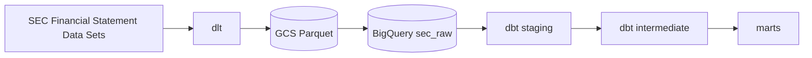
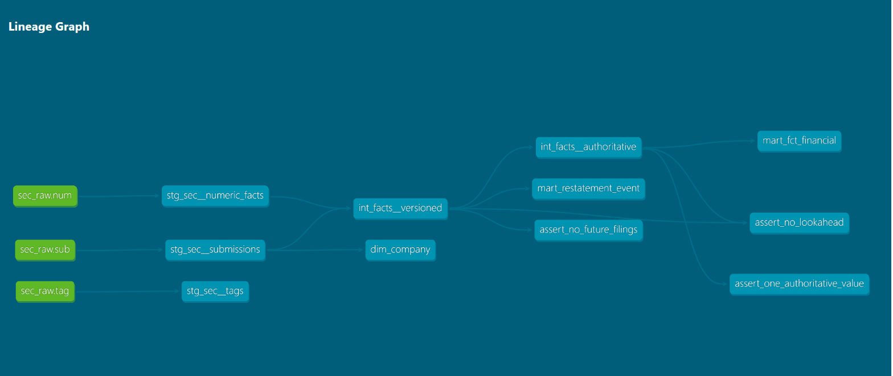

# sec-pit-warehouse

A point-in-time-correct dbt warehouse over US public-company financial fundamentals
from raw SEC XBRL filings. Companies restate their financials; a naive warehouse
overwrites the old number and loses the fact that, on a given date, the market
believed something different. This one keeps every filed version of every fact, so
you can ask *what was knowable on date D*, and a merge-blocking CI test prevents any
downstream model from referencing a fact before it was publicly filed.

Headline numbers, from 29 quarters of filings (2019q1 to 2026q1) covering 24.3 M
authoritative facts:

- 89.7% of companies (9,967 of 11,115) revised at least one previously filed fact.
- 3.57% of facts (865,755 of 24,278,748) had their value changed by a later filing.
- 50.8% of facts were re-filed at least once. But most re-filings repeat the number
  unchanged. `mart_restatement_event` classifies each one rather than assuming a
  re-filing is a revision.

A fact can only be revised as often as the window lets it, but at 29 quarters most facts
have seen at least one annual comparative re-filing, which is where revisions generally
occur. The median revision lands 361 days after the original, a 10-K restating the prior
year rather than a scatter of one-off corrections.

## Architecture



DuckDB is dev and CI; BigQuery is prod. The same dbt models run on both. Cross-engine
differences (`strptime` vs `parse_date`, `try_cast` vs `safe_cast`, `datediff`) are
isolated in three macros under `transform/macros/`.

## Point-in-time correctness

The warehouse is **bi-temporal**: *valid time* is the period a fact describes
(`end_date`), *transaction time* is when it was filed (`date_filed`). Keeping both is
what makes an as-of query possible.

| Model | Grain | Role |
|---|---|---|
| `int_facts__versioned` | one row per `(cik, tag, end_date, qtrs, uom, adsh)` | every filed version of every fact, nothing resolved |
| `int_facts__authoritative` | one row per `(cik, tag, end_date, qtrs, uom)` | one winner per fact |
| `mart_restatement_event` | one row per re-assertion | what changed, by how much, how many days later |
| `mart_fct_financial` | same grain as authoritative | fact table, FK to `dim_company` |
| `dim_company` | one row per `cik` | SCD1 as of now, current attributes only |

**Resolution rule.** Later `date_filed` wins, because the later filing is the
company's more current assertion about the same period. Ties break on `date_accepted`,
then `accession_number` so the result is deterministic.

**Three singular tests are merge-blocking** (`transform/tests/`):

- `assert_no_lookahead`: no version of a fact may be filed *later* than the row chosen
  as authoritative for it.
- `assert_one_authoritative_value`: no fact resolves to more than one value.
- `assert_no_future_filings`: nothing is filed after today.

`date_filed < end_date` was evaluated as a lookahead signal and **rejected**: ordinary
tags (`CommonStockSharesIssued`, `OperatingLeaseLiabilityNoncurrent`) routinely report a
period-end value before the period closes, with no clean way to separate those from real
errors.

CI has been merge-blocking since day 1: ruff, sqlfluff, pytest, and `dbt build` on
DuckDB against a committed 200-row fixture quarter.

<!-- TODO: drop the CI-failure screenshot here. Branch: sabotage/prove-ci-blocks -->

## Scale

Measured on BigQuery, `dbt build --target prod` over the full 29-quarter backfill:

| | |
|---|---|
| Quarters loaded | 29 (2019q1 → 2026q1) |
| Filings (`sub`) | 197,934 |
| Raw numeric rows | 95,474,611 |
| Consolidated facts (`segments = ''`) | 45,945,981 |
| Authoritative facts | 24,278,748 |
| Companies | 11,119 (11,115 with at least one fact) |
| Re-assertion events | 21,667,233 |
| Filing dates covered | 2019-01-02 → 2026-03-31 |
| `dbt build --target prod` | 8 models, 38 tests, **37 s**, 27.4 GiB scanned |

`int_facts__versioned` holds 45,945,981 rows, the same as the consolidated count, so the
inner join to `sub` drops nothing and every numeric fact has a parent filing. Subtracting
authoritative from versioned leaves 21,667,233, which is the mart's row count exactly.
The mart's `rank()` window and the intermediate's `qualify` were written separately, so
the two agreeing is a check on both.

Re-assertion events break down as:

| `revision_type` | Events | Share |
|---|---|---|
| `reaffirmation` (same value re-reported) | 20,149,068 | 92.99% |
| **`value_revision` (the number moved)** | **954,391** | **4.40%** |
| `both_absent` (neither filing carried a value) | 513,777 | 2.37% |
| `first_reported_value` (earlier filing had none) | 25,757 | 0.12% |
| `value_withdrawn` (later filing dropped it) | 24,240 | 0.11% |

Only `value_revision` moved a number. Collapsing the other four into the headline is what
turns a 3.57% revision rate into a 50.8% one.

Across the 954,391 value revisions:

| | |
|---|---|
| Median lag, original → revision | 361 days |
| p90 lag | 371 days |
| Longest lag | 2,173 days (≈ 5.9 years) |
| Moved the number by more than 1% | 711,411 (74.5%) |
| Revised away from a reported zero | 14,235 |

The mean of 283 days sits below the median because a minority of fast revisions pull it
left. The most revised tags are `NetIncomeLoss`, `StockholdersEquity`,
`OperatingIncomeLoss`, `EarningsPerShareBasic` and `EarningsPerShareDiluted`.

## Cost

`num` and `sub` are partitioned on `source_quarter_start`, a real `DATE` because BigQuery
will not partition on a string. `num` is clustered on `(adsh, tag)` and `sub` on `cik`.
Partition hints are creation-only, so they were set before the backfill.

The 2026q1 partition holds 3,690,953 of 95,474,611 rows, so a single-quarter query reads
about 3.9% of the table. Dry-run bytes over `num`, counting distinct `adsh` so the query
touches a real column:

| Query | Bytes processed |
|---|---|
| Full scan | 2.10 GB |
| Single quarter (`source_quarter_start = '2026-01-01'`) | 110.7 MB |

A 19x reduction. Byte share is 5.3% against a row share of 3.9%, because the filtered
query reads `adsh` plus the partition key where the full scan reads one column. Both
figures come from `bq --dry_run`. `select count(*)` is answered from table metadata and
bills nothing, so it cannot be used to measure this.

A full `dbt build --target prod` scans 27.4 GiB, mostly the two intermediate models
(12.9 GiB for `int_facts__versioned`, 6.4 GiB for `int_facts__authoritative`). At the
$6.25/TiB on-demand rate that is about $0.17 per rebuild, inside the 1 TiB monthly free
tier at a quarterly cadence.

dlt stages Parquet to GCS and BigQuery loads from there. Load jobs are free; streaming
inserts are billed per byte for a freshness quarterly data does not need. GCS holds
2.59 GiB, inside the 5 GiB free tier and capped by the 90-day delete rule in
`infra/main.tf`.

BigQuery holds 34.1 GiB of logical bytes: `sec_raw` 18.1, intermediate 9.5, marts 6.5.
The staging dataset is views and stores nothing. At $0.02/GiB/month with the first 10 GiB
free, that is about $0.48/month, dropping as `sec_raw` ages past 90 days into the $0.01
long-term rate. Storage is the only recurring line.

## Data model

Grain and resolution rules per model: [`docs/data_model.md`](docs/data_model.md).

Lineage graph, regenerated with `cd transform && dbt docs generate && dbt docs serve`:



`stg_sec__tags` is deliberately a leaf: the XBRL tag dictionary is staged for
exploration but no model consumes it, because `(tag, version)` is carried down from
`num` directly and the label text is not needed downstream.

## Decisions and tradeoffs

<!-- TODO: still to write. docs/architecture.md has the dated entries to pull from.
     Cover at least:

       - Raw layer is all strings; typing happens in staging.
       - QUOTE_NONE in read_csv: 2 unparseable rows out of 5.2M, to avoid silently
         shifting columns.
       - Filter to segments = ''. Segment detail is a different grain and would
         inflate the revision rate.
       - uom belongs in the grain; two currencies are two facts, not a disagreement.
       - Append-only raw with quarter-level state, not merge.
       - source_quarter_start added at ingest because BigQuery won't partition on a string.
       - Service-account key over WIF, and project-scoped IAM. Both speed tradeoffs.
       - Narrowing assert_no_lookahead instead of leaving it red.
       - What got cut and why: no Dagster, no SCD2 company history, no segment grain.
       - What I would do differently.
-->

See [`docs/architecture.md`](docs/architecture.md) for the dated decision log and the
XBRL trap list. Deferred work is in [`docs/backlog.md`](docs/backlog.md).

## Related work

[`secfsdstools`](https://github.com/HansjoergW/sec-financial-statement-data-set) parses
these datasets well, but it also builds its own Parquet store and a SQLite index queried
through its collector classes. It is a data warehouse, which is the thing this project
is for. It would have saved about forty lines of `requests` and `zipfile`, but its not
worth introducing any dependencies. And I would rather own the core functionality myself.

## Setup

Requires [uv](https://docs.astral.sh/uv/) and Python 3.12, specifically 3.12: the pinned
`duckdb==1.4.1` has no wheel for 3.13+ and will try to compile from source.

```bash
git clone https://github.com/ari-butterfield/sec-pit-warehouse.git
cd sec-pit-warehouse

uv venv --python 3.12 && source .venv/bin/activate
uv pip install -r requirements.txt

export DBT_PROFILES_DIR=$PWD/transform
# dlt keeps pipeline state in ~/.dlt by default, which makes a re-clone a silent
# no-op on a machine that has run this before. Keep the state in the clone.
export DLT_DATA_DIR=$PWD/.dlt_state
```

The warehouse itself is not in git. Seed the committed 200-row fixture quarter, the same
one CI uses, and build:

```bash
cd ingest
mkdir -p .cache && cp tests/fixtures/sample_quarter.zip .cache/1900q1.zip
python load_sec_quarter.py 1900q1 --db-path ../transform/ci.duckdb
cd ../transform && dbt deps && dbt build --target ci
```

Expected: `PASS=46 WARN=0 ERROR=0`.

To load real data instead (~4 GB per quarter downloaded from the SEC, and the SEC
fair-access policy requires the declared user agent in `ingest/.dlt/config.toml`):

```bash
cd ingest && python load_sec_quarter.py 2026q1                  # DuckDB, dev
cd ingest && python load_sec_quarter.py 2026q1 --destination bigquery
cd transform && dbt build                                        # DuckDB, dev
cd transform && dbt build --target prod                          # BigQuery
```

BigQuery needs `GOOGLE_APPLICATION_CREDENTIALS` and `GCP_PROJECT_ID`. Terraform for the
bucket, datasets, and service account is in `infra/`. Run it without the pipeline
credentials, which have no IAM rights:

```bash
env -u GOOGLE_APPLICATION_CREDENTIALS terraform -chdir=infra apply
```

## License

[MIT](LICENSE)
