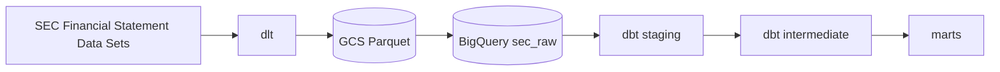

# sec-pit-warehouse

A point-in-time-correct dbt warehouse over US public-company financial fundamentals
from raw SEC XBRL filings. Companies restate their financials. A naive warehouse
overwrites the old number and forgets that on a given date, the market believed
something different. This warehouse files all versions of every fact, tracking the
dates it was filed, so you can reconstruct ***what facts were known on date D***.
Merge-blocking CI tests uphold the resolution rule, the fact grain, and a bound
on the filing date.

```
Headline numbers, from 29 quarters of filings (2019q1 to 2026q1) covering 24.3 M
authoritative facts:

- 89.7% of companies (9,967 of 11,115) revised at least one previously filed fact.
- 3.57% of facts (865,755 of 24,278,748) had their value changed by a later filing.
  Those 865,755 facts were revised across 954,391 events, because a fact can be
  revised more than once.
- 50.8% of facts were re-filed at least once. But most re-filings repeat the number
  unchanged. `mart_restatement_event` classifies each form of re-filing.
```
Newer facts have had less opportunity for revision, but at 29 quarters most facts have 
seen at least one annual comparative re-filing, which is where revisions generally
occur. The median revision lands 361 days after the original, a 10-K restating the prior
year rather than a scatter of one-off corrections.

## Architecture



DuckDB is dev and CI; BigQuery is prod. The same dbt models run on both. Cross-engine
differences (`strptime` vs `parse_date`, `try_cast` vs `safe_cast`, `datediff`) are
isolated in three macros under `transform/macros/`.

## Point-in-time correctness

The warehouse is **bi-temporal**: *valid time* is the period a fact describes
(`end_date`), *transaction time* is when it was filed (`date_filed`). Keeping both is
what makes an as-of query possible.

| Model | Grain | Role |
|---|---|---|
| `int_facts__versioned` | one row per `(cik, tag, end_date, qtrs, uom, adsh)` | every filed version of every fact, nothing resolved |
| `int_facts__authoritative` | one row per `(cik, tag, end_date, qtrs, uom)` | one winner per fact |
| `mart_restatement_event` | one row per re-assertion | what changed, by how much, how many days later |
| `mart_fct_financial` | same grain as authoritative | fact table, FK to `dim_company` |
| `dim_company` | one row per `cik` | SCD1 as of now, current attributes only |

**Resolution rule.** Later `date_filed` wins, because the later filing is the
company's more current assertion about the same period. Ties break on `date_accepted`,
then `accession_number` so the result is deterministic.

**Three singular tests are merge-blocking** (`transform/tests/`):

- `assert_no_lookahead`: no version of a fact may be filed *later* than the row chosen
  as authoritative for it.
- `assert_one_authoritative_value`: no fact resolves to more than one value.
- `assert_no_future_filings`: nothing is filed after today.

`date_filed < end_date` was evaluated as a lookahead signal and rejected: ordinary
tags (`CommonStockSharesIssued`, `OperatingLeaseLiabilityNoncurrent`) routinely report a
period-end value before the period closes, with no clean way to separate those from real
errors.

CI has been merge-blocking since the start: ruff, sqlfluff, pytest, and `dbt build` on
DuckDB against a committed 200-row fixture quarter.

## Scale

Measured on BigQuery, `dbt build --target prod` over the full 29-quarter backfill:

| | |
|---|---|
| Quarters loaded | 29 (2019q1 → 2026q1) |
| Filings (`sub`) | 197,934 |
| Raw numeric rows | 95,474,611 |
| Consolidated facts (`segments = ''`) | 45,945,981 |
| Authoritative facts | 24,278,748 |
| Companies | 11,119 (11,115 with at least one fact) |
| Re-assertion events | 21,667,233 |
| Filing dates covered | 2019-01-02 → 2026-03-31 |
| `dbt build --target prod` | 8 models, 38 tests, **37 s**, 27.4 GiB scanned |

`int_facts__versioned` holds 45,945,981 rows, the same as the consolidated count, so the
inner join to `sub` drops nothing and every numeric fact has a parent filing. Subtracting
authoritative from versioned leaves 21,667,233, which is the mart's row count exactly.
The mart's `rank()` window and the intermediate's `qualify` were written separately, so
the two agreeing is a check on both.

Re-assertion events break down as:

| `revision_type` | Events | Share |
|---|---|---|
| `reaffirmation` (same value re-reported) | 20,149,068 | 92.99% |
| **`value_revision` (the number changed)** | **954,391** | **4.40%** |
| `both_absent` (neither filing carried a value) | 513,777 | 2.37% |
| `first_reported_value` (earlier filing had none) | 25,757 | 0.12% |
| `value_withdrawn` (later filing dropped it) | 24,240 | 0.11% |

Only `value_revision` changed the number. This demonstrates how 50.8% of facts are re-asserted
while only 3.57% are revised.

Across the 954,391 `value_revision` events, which moved 865,755 distinct facts:

| | |
|---|---|
| Median lag, original → revision | 361 days |
| Mean lag | 283 days |
| p90 lag | 371 days |
| Longest lag | 2,173 days (≈ 5.9 years) |
| Moved the number by more than 1% | 711,411 (74.5%) |
| Revised away from a reported zero | 14,235 |

The most revised tags are `NetIncomeLoss`, `StockholdersEquity`,
`OperatingIncomeLoss`, `EarningsPerShareBasic` and `EarningsPerShareDiluted`.

## Cost

Roughly $0.17 per full rebuild and $0.48/month in storage. Partitioning is what keeps it there.

`num` and `sub` are partitioned by quarter (`source_quarter_start`) and clustered on `(adsh, tag)` and `cik`. Reading one quarter instead of the whole table, measured with `bq --dry_run`:

| Query over `num` | Bytes processed |
|---|---|
| Full scan | 2.10 GB |
| One quarter | 110.7 MB |

A 19x reduction. A full `dbt build --target prod` scans 27.4 GiB, about $0.17 at on-demand rates, and a quarterly rebuild stays inside the 1 TiB monthly free tier.

Storage is 34.1 GiB in BigQuery plus 2.59 GiB in GCS, about $0.48/month, and it is the only recurring line. dlt stages Parquet to GCS and BigQuery loads from there, because load jobs are free where streaming inserts are billed per byte.

Partition and cluster hints are creation-only, so if you want different ones, set them before you backfill or you will be rebuilding the tables.

## Data model

Grain and resolution rules per model: [`docs/data_model.md`](docs/data_model.md).

Lineage graph, regenerated with `cd transform && dbt docs generate && dbt docs serve`:


`stg_sec__tags` is deliberately a leaf: the XBRL tag dictionary is staged for
exploration but no model consumes it, because `(tag, version)` is carried down from
`num` directly and the label text is not needed downstream.

## Decisions and tradeoffs

**Raw layer is all strings.** dlt reads every SEC column as text and types nothing on
the way in. This way, all quarters land as data instead of failing a load for a changed
format. Every type cast lives in staging where it is visible and testable. The cost is
that staging carries a cast for almost every column.

**`QUOTE_NONE` when reading the source files.** Treating quote characters as ordinary
text costs 2 unparseable rows out of roughly 5.2M in 2026q1. If I let pandas honor quotes,
it can swallow tabs inside quoted fields and shift whole columns with no error. Losing two
rows loudly beats the possbility of silently corrupting many rows.

**Consolidated facts only (`segments = ''`).** `num.txt` carries a tenth column the
published SEC spec does not mention, holding a dimensional qualifier for a slice of
the company rather than the whole company. A segment row and a consolidated row share
every other key, so keeping both would make a segment breakdown look like a competing
version of the same fact and inflate the revision rate. So I deffered and filtered out
the segment grain.

**Unit of measure belongs in the fact grain.** The same concept for the same period is
filed in USD and CAD by the same company. Two currencies are two facts, not a
disagreement about one, so `unit_of_measure` sits in the key rather than being filtered
or resolved. Taxonomy `version` deliberately does not represent a separate fact,
because it records the version of the dictionary edition, but not the value that was asserted.

**Raw is append-only, with state tracked per quarter.** dlt records which quarters have
loaded and skips them on a re-run, so a re-run is a no-op rather than a merge. That is
cheaper than deduplicating tens of millions of rows at load time, and it keeps the raw
layer an immutable record of what the SEC published. A pytest case asserts the second
run of a quarter loads zero rows.

**`assert_no_lookahead` was narrowed rather than left red.** The first version tested
`date_filed < end_date`, on the assumption that nothing can be filed about a period that
has not closed. That is false: ordinary tags such as `CommonStockSharesIssued` and
`OperatingLeaseLiabilityNoncurrent` routinely report a period-end value before the period
ends, and lease and debt maturity schedules legitimately run years ahead. With no clean
way to separate those from filer typos, the bound shipped as `assert_no_future_filings`
instead, and `assert_no_lookahead` was narrowed to guard the resolution rule. It is a
regression guard on `int_facts__authoritative`, not an independent as-of check.

**Not included yet.** No orchestrator, so loads are run by hand at a quarterly cadence. No
SCD2 on `dim_company`, so company renames and SIC reclassifications are overwritten. No
segment grain. No bounds test on `end_date`, which runs from `1011-12-31` to `2923-12-31`
across the backfill. Each is in [`docs/backlog.md`](docs/backlog.md) with the reason.

**What I would do differently.** Model every layer, its grain, and its keys in one diagram before writing any SQL. I built outward from the source files instead. The grain moved twice and this was more difficult to follow. The unit of measure entered the fact key after int_facts__versioned was written, and dim_company arrived only once the marts were already repeating company attributes on every fact row. This is cheap to fix at 8 models but would be very problematic for a larger warehouse.


See [`docs/architecture.md`](docs/architecture.md) for the dated decision log and the
XBRL trap list. Deferred work is in [`docs/backlog.md`](docs/backlog.md).

## Related work

[`secfsdstools`](https://github.com/HansjoergW/sec-financial-statement-data-set) parses
these datasets well, but it also builds its own Parquet store and a SQLite index queried
through its collector classes. It is itself a data warehouse, which is the thing this
project is for. It would have saved about forty lines of `requests` and `zipfile`, and
those forty lines are where the encoding and quoting traps live. I'd rather not take a
dependency on the core of the project.

## Setup

Requires [uv](https://docs.astral.sh/uv/) and Python 3.12, specifically 3.12: the pinned
`duckdb==1.4.1` has no wheel for 3.13+ and will try to compile from source.

```bash
git clone https://github.com/ari-butterfield/sec-pit-warehouse.git
cd sec-pit-warehouse

uv venv --python 3.12 && source .venv/bin/activate
uv pip install -r requirements.txt

export DBT_PROFILES_DIR=$PWD/transform
# dlt keeps pipeline state in ~/.dlt by default, which makes a re-clone a silent
# no-op on a machine that has run this before. Keep the state in the clone.
export DLT_DATA_DIR=$PWD/.dlt_state
```

The warehouse itself is not in git. Seed the committed 200-row fixture quarter, the same
one CI uses, and build:

```bash
cd ingest
mkdir -p .cache && cp tests/fixtures/sample_quarter.zip .cache/1900q1.zip
python load_sec_quarter.py 1900q1 --db-path ../transform/ci.duckdb
cd ../transform && dbt deps && dbt build --target ci
```

Expected: `PASS=46 WARN=0 ERROR=0`.

To load real data instead (~4 GB per quarter downloaded from the SEC, and the SEC
fair-access policy requires the declared user agent in `ingest/.dlt/config.toml`):

```bash
cd ingest && python load_sec_quarter.py 2026q1                  # DuckDB, dev
cd ingest && python load_sec_quarter.py 2026q1 --destination bigquery
cd transform && dbt build                                        # DuckDB, dev
cd transform && dbt build --target prod                          # BigQuery
```

BigQuery needs `GOOGLE_APPLICATION_CREDENTIALS` and `GCP_PROJECT_ID`. Terraform for the
bucket, datasets, and service account is in `infra/`. Run it without the pipeline
credentials, which have no IAM rights:

```bash
env -u GOOGLE_APPLICATION_CREDENTIALS terraform -chdir=infra apply
```

## License

[MIT](LICENSE)
