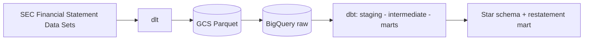

# sec-pit-warehouse

A point-in-time-correct dbt warehouse over US public-company financial fundamentals
from raw SEC XBRL filings. Merge-blocking CI test prevents any downstream
model from silently referencing a fact before it was publicly filed.

> **Headline finding:** _pending

## Architecture



## Point-in-time correctness

_Pending_

## Scale

_Pending_

## Cost

_Pending_

## Data model

See [`docs/data_model.md`](docs/data_model.md).

## Decisions and tradeoffs

See [`docs/architecture.md`](docs/architecture.md).

## Related work

_Pending_

## Setup

```bash
git clone https://github.com/ari-butterfield/sec-pit-warehouse.git
cd sec-pit-warehouse
python3 -m venv .venv && source .venv/bin/activate
pip install -r requirements.txt
export DBT_PROFILES_DIR=$PWD/transform
cd transform && dbt build
```
